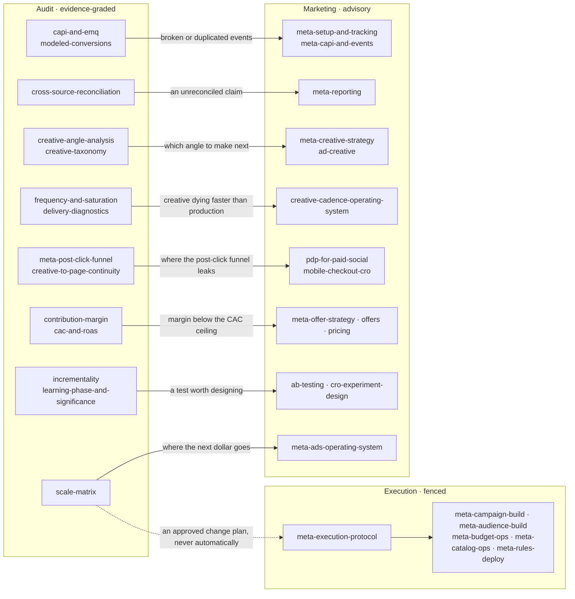

# Skill index

105 skills in three layers. They live in one directory and **do not carry the same authority** —
that distinction is the point of the layering, and `CLAUDE.md` enforces it.

| Layer | Count | Authority |
|---|---:|---|
| **Audit** | 46 | Establishes what is true. Evidence-graded; may be cited in findings |
| **Marketing** | 53 | Proposes what to build. Advisory; **never evidence for a number** |
| **Execution** | 6 | Governs mutations. Loadable only in the execution lane |

Handoffs run **audit → marketing, never the reverse.** A marketing skill's benchmark, threshold
or rule of thumb is not evidence: a recommendation originating in one still needs a number,
source, date range, formula, evidence class and confidence from the audit layer before it can be
presented as a finding. Each marketing skill carries a banner saying so.

---

## Audit layer (46)

Consumed by agents, cited in findings, subject to the evidence contract in
`schemas/finding-schema.yaml`.

### Run control

| Skill | What it establishes |
|---|---|
| [`full-audit`](.claude/skills/full-audit/SKILL.md) | Run the complete e-commerce Meta Ads account audit end to end across all 30 audit sections, using the Meta connector, commerce and analytics connector… |
| [`audit-preflight`](.claude/skills/audit-preflight/SKILL.md) | Run before any Meta audit or task — checks whether the business-context document exists and is current, and whether the connectors the work needs are… |
| [`audit-artifacts`](.claude/skills/audit-artifacts/SKILL.md) | When creating and writing the persistent output of a Meta audit run — the run directory, which artifacts every full audit must produce, and why runs a… |
| [`coverage-ledger`](.claude/skills/coverage-ledger/SKILL.md) | When recording which of the 30 audit sections ran and what each concluded — the five coverage states, how to derive the tally, and why an unrun sectio… |
| [`agent-routing`](.claude/skills/agent-routing/SKILL.md) | When deciding which specialist agent or workflow answers a request — mapping a question to the section that owns it, choosing between a full audit and… |
| [`data-cache`](.claude/skills/data-cache/SKILL.md) | When caching source results within an audit run so downstream agents reuse them instead of re-querying Meta. Use whenever an agent needs data another… |
| [`14-day-change-control`](.claude/skills/14-day-change-control/SKILL.md) | When sequencing changes to a Meta account so each one can actually be judged — the read window, learning-phase cost, one-material-change-at-a-time, an… |

### Discovery & extraction

| Skill | What it establishes |
|---|---|
| [`mcp-discovery`](.claude/skills/mcp-discovery/SKILL.md) | When establishing which data sources are actually reachable for a Meta audit — walking the connector ladder, discovering real tool names and schemas a… |
| [`meta-ads-mcp`](.claude/skills/meta-ads-mcp/SKILL.md) | When querying the Meta Ads connector for audit data — which call answers which question, the entity levels and fields, breakdown rules, and the read/w… |
| [`meta-ads-data-validation`](.claude/skills/meta-ads-data-validation/SKILL.md) | When checking that data pulled from the Meta connector is complete and comparable before analysing it — row completeness against parent totals, window… |
| [`shopify-extraction`](.claude/skills/shopify-extraction/SKILL.md) | When pulling revenue truth from the commerce platform for a Meta audit — orders, line items, margin inputs, new-vs-returning customer status, refunds… |
| [`ga4-extraction`](.claude/skills/ga4-extraction/SKILL.md) | When pulling behavioural and mid-funnel data from GA4 for a Meta audit — session and funnel events, landing pages, source/medium, device and geography… |
| [`ad-library-extraction`](.claude/skills/ad-library-extraction/SKILL.md) | When pulling competitor creative from the Meta Ad Library for competitive context — which angles, offers and formats the category runs, how long they… |
| [`browser-inspection`](.claude/skills/browser-inspection/SKILL.md) | When inspecting the rendered post-click experience that Meta traffic actually lands on — landing pages, product pages, cart and checkout, on mobile an… |

### Measurement — the gate

| Skill | What it establishes |
|---|---|
| [`ecommerce-measurement`](.claude/skills/ecommerce-measurement/SKILL.md) | When judging whether a D2C store's purchase measurement is good enough to optimise on — the GREEN/YELLOW/RED verdict that orders the rest of a Meta au… |
| [`capi-and-emq`](.claude/skills/capi-and-emq/SKILL.md) | When auditing the Meta pixel, Conversions API, event deduplication and Event Match Quality on an e-commerce account — whether purchase signal actually… |
| [`modeled-conversions`](.claude/skills/modeled-conversions/SKILL.md) | When separating what Meta observed from what Meta modelled or estimated — modelled conversions, view-through attribution, Aggregated Event Measurement… |
| [`link-tracking`](.claude/skills/link-tracking/SKILL.md) | When auditing whether a store can attribute its own paid traffic — UTM parameters on Meta destination URLs, click id capture and persistence, redirect… |
| [`cross-source-reconciliation`](.claude/skills/cross-source-reconciliation/SKILL.md) | When setting Meta's claimed purchases and revenue against banked orders from Shopify and GA4 — the mandatory reconciliation that runs before any econo… |
| [`conflict-resolution`](.claude/skills/conflict-resolution/SKILL.md) | When two sources or two agents disagree about the same number — the order in which to check definitions before assuming a defect, which source wins fo… |

### Economics — the gate

| Skill | What it establishes |
|---|---|
| [`business-context`](.claude/skills/business-context/SKILL.md) | When establishing the commercial frame an audit judges everything against — the one primary goal, the product and customer context, hero products, pro… |
| [`contribution-margin`](.claude/skills/contribution-margin/SKILL.md) | When establishing the canonical unit economics for a D2C account — gross margin, contribution margin, and the variable costs that sit between revenue… |
| [`cac-and-roas`](.claude/skills/cac-and-roas/SKILL.md) | When turning contribution margin into the targets that decide every scale and kill call on a Meta account — break-even ROAS, CAC ceiling, new-customer… |

### Creative

| Skill | What it establishes |
|---|---|
| [`creative-data-model`](.claude/skills/creative-data-model/SKILL.md) | When building or reading the creative database for a Meta ad account — the one row-per-ad dataset that every creative analysis computes from. Use when… |
| [`ad-copy-audit`](.claude/skills/ad-copy-audit/SKILL.md) | What the running ad copy actually says — primary text, headline, description and CTA read from the creative database, scored on six craft dimensions and joined to what each ad measurably earned. Rewrites only where copy is the plausible constraint |
| [`creative-taxonomy`](.claude/skills/creative-taxonomy/SKILL.md) | When classifying what a Meta ad actually IS — concept type, angle, hook, proof, objection, offer, persona, creator and format — so creative performanc… |
| [`creative-angle-analysis`](.claude/skills/creative-angle-analysis/SKILL.md) | When determining which creative dimension actually drives purchases on a Meta account — hook, problem, benefit, product, proof point, objection, forma… |
| [`creative-testing-engine`](.claude/skills/creative-testing-engine/SKILL.md) | When auditing or designing a repeatable creative testing program for a Meta account — testing velocity, budget math, the iteration hierarchy, winner a… |
| [`creative-dashboard`](.claude/skills/creative-dashboard/SKILL.md) | When rendering a Meta account's creative performance as a Top Creatives dashboard — ad cards ranked by spend, purchases, ROAS, hook rate or hold rate… |
| [`frequency-and-saturation`](.claude/skills/frequency-and-saturation/SKILL.md) | When diagnosing whether a Meta ad is dying because the creative wore out or because the audience ran out — frequency thresholds by campaign type, audi… |
| [`delivery-diagnostics`](.claude/skills/delivery-diagnostics/SKILL.md) | When diagnosing why a Meta ad is expensive to deliver rather than why it converts badly — Quality, Engagement Rate and Conversion Rate Ranking, auctio… |

### Truth & decision

| Skill | What it establishes |
|---|---|
| [`attribution`](.claude/skills/attribution/SKILL.md) | When deciding which attribution window and model a Meta account should run on, and reconciling Meta's view against GA4, the commerce platform and the… |
| [`incrementality`](.claude/skills/incrementality/SKILL.md) | When determining how much of Meta's reported revenue would have happened anyway — geo holdouts, conversion lift studies, retargeting incrementality, a… |
| [`learning-phase-and-significance`](.claude/skills/learning-phase-and-significance/SKILL.md) | When deciding whether a Meta ad, ad set or angle has produced enough data to judge — the purchase floors below which a kill or scale call is variance… |
| [`leading-and-lagging-signals`](.claude/skills/leading-and-lagging-signals/SKILL.md) | When the purchase count on an entity is too thin to judge it, and you need a faster signal that has been validated to predict purchases on this account. Use when… |
| [`demand-lifecycle`](.claude/skills/demand-lifecycle/SKILL.md) | When classifying a Meta account's spend by what job it does — creating demand, capturing existing demand, accelerating a decided buyer, reviving a lapsed one, or… |
| [`funnel-analysis`](.claude/skills/funnel-analysis/SKILL.md) | When mapping and sizing the Meta post-click funnel — impression to 3-second view to click to landing-page view to product view to add-to-cart to check… |
| [`recommendation-prioritization`](.claude/skills/recommendation-prioritization/SKILL.md) | When merging findings from across an audit into one ranked, de-duplicated opportunity matrix and sequencing them into a 30/60/90 plan. Use when the us… |
| [`scale-matrix`](.claude/skills/scale-matrix/SKILL.md) | When deciding where the next dollar goes on a Meta account — ranking creative x product x offer x audience combinations by incremental profit rather t… |

### Diagnostics by section

| Skill | What it establishes |
|---|---|
| [`campaign-rca`](.claude/skills/campaign-rca/SKILL.md) | When a Meta campaign has underperformed and the cause could be anywhere — objective, targeting, creative, bidding, or the tracking layer — and a syste… |
| [`bid-strategy-and-learning`](.claude/skills/bid-strategy-and-learning/SKILL.md) | When auditing how a Meta account buys — bid strategy per campaign, learning-phase state, learning-limited detection, and whether a cost cap is set som… |
| [`placement-economics`](.claude/skills/placement-economics/SKILL.md) | When judging which Meta placements earn their share of budget — Feed, Stories, Reels, Explore, Audience Network, Messenger — after conversion rate and… |
| [`catalog-health`](.claude/skills/catalog-health/SKILL.md) | When auditing a Meta product catalog and dynamic ads — feed sync health, product diagnostics, disapprovals, item ID stability, price parity against th… |
| [`advantage-plus-audit`](.claude/skills/advantage-plus-audit/SKILL.md) | When auditing Advantage+ Shopping and Advantage+ Creative on a live account — ASC structure and budget, the existing-customer budget cap, new-customer… |
| [`audience-insights-mining`](.claude/skills/audience-insights-mining/SKILL.md) | When building a quantitative profile of who actually converts on a Meta account — age, gender, device, country and daypart — from the account's own pe… |
| [`scaling-methods`](.claude/skills/scaling-methods/SKILL.md) | When executing a scale decision on Meta — the readiness checklist that gates it, the four scaling methods with their day-by-day budget steps, and how… |

---

## Marketing layer (53)

Build-time guidance. Advisory by construction: these propose what to make, and the audit layer
decides whether it worked.

### Meta strategy

| Skill | What it proposes |
|---|---|
| [`meta-ads`](.claude/skills/meta-ads/SKILL.md) | When the user wants to manage Meta (Facebook/Instagram) ads for an e-commerce or D2C brand — the hub for audience strategy, campaign structure, creati… |
| [`meta-overview`](.claude/skills/meta-overview/SKILL.md) | When the user wants the ground truth on Meta ads for an e-commerce or D2C brand — why it's the core paid channel for most brands, how the algorithm ac… |
| [`meta-ads-operating-system`](.claude/skills/meta-ads-operating-system/SKILL.md) | When the user wants to make an operational decision on a Meta Ads account for an e-commerce or D2C brand — when to pause, swap, graduate, or scale an… |
| [`meta-campaign-structure`](.claude/skills/meta-campaign-structure/SKILL.md) | When the user wants to structure Meta campaigns for an e-commerce or D2C brand — account architecture, prospecting/retargeting/retention layout, budge… |
| [`meta-campaign-creation`](.claude/skills/meta-campaign-creation/SKILL.md) | When the user wants to create campaigns, ad sets, ads, or audiences on Meta for an e-commerce or D2C brand — the full build chain and the settings tha… |
| [`meta-optimization-playbook`](.claude/skills/meta-optimization-playbook/SKILL.md) | When the user wants to optimize a live Meta Ads account for an e-commerce or D2C brand — the diagnosis order for rising CAC or falling ROAS, ecom benc… |
| [`meta-advantage-plus`](.claude/skills/meta-advantage-plus/SKILL.md) | When the user is deciding whether and how to use Advantage+ shopping campaigns for an e-commerce or D2C brand — what to let Meta automate, what to con… |
| [`meta-automated-rules`](.claude/skills/meta-automated-rules/SKILL.md) | When the user wants to automate account maintenance on Meta for an e-commerce or D2C brand — native Automated Rules or Marketing API automation that p… |
| [`meta-api-reference`](.claude/skills/meta-api-reference/SKILL.md) | When the user is building or modifying Meta ads objects for an e-commerce or D2C store and needs the reference layer — which Meta Ads MCP tool does wh… |

### Meta creative

| Skill | What it proposes |
|---|---|
| [`meta-creative-strategy`](.claude/skills/meta-creative-strategy/SKILL.md) | When the user wants to plan Meta (Facebook/Instagram) ad creative for an e-commerce or D2C brand — creative-as-targeting, customer-situation angles, c… |
| [`meta-creative-formats`](.claude/skills/meta-creative-formats/SKILL.md) | When the user wants to choose the right Meta ad format and asset specs for an e-commerce or D2C brand — single image vs video vs carousel vs Collectio… |
| [`creative-cadence-operating-system`](.claude/skills/creative-cadence-operating-system/SKILL.md) | When the user wants a creative production and iteration system for an e-commerce or D2C Meta account — the iteration priority hierarchy, concept sourc… |
| [`creative-fatigue-detection`](.claude/skills/creative-fatigue-detection/SKILL.md) | When the user wants to diagnose creative fatigue on an e-commerce or D2C Meta account — the signals an ad is dying, frequency thresholds by campaign t… |
| [`message-validation`](.claude/skills/message-validation/SKILL.md) | When the user wants to validate which ad messages actually drive profitable customers for an e-commerce or D2C brand — scoring ads by new-customer val… |
| [`ad-creative`](.claude/skills/ad-creative/SKILL.md) | When the user wants to generate, iterate, or scale ad creative — headlines, descriptions, primary text, or full ad variations — for any paid advertisi… |
| [`ad-headline-techniques`](.claude/skills/ad-headline-techniques/SKILL.md) | When the user wants ad or landing page headlines built from a named creative technique, rather than general headline advice. Use when the user asks fo… |
| [`ad-writing-style`](.claude/skills/ad-writing-style/SKILL.md) | When the user wants everything an agent writes to stop sounding like an AI wrote it — a banned-word and banned-structure list plus positive rules gove… |
| [`copywriting`](.claude/skills/copywriting/SKILL.md) | When the user wants to write, rewrite, or improve marketing copy for any page — including homepage, landing pages, pricing pages, feature pages, about… |
| [`copy-editing`](.claude/skills/copy-editing/SKILL.md) | When the user wants to edit, review, or improve existing marketing copy, or refresh outdated content. |

### Meta audience & offer

| Skill | What it proposes |
|---|---|
| [`meta-audience-strategy`](.claude/skills/meta-audience-strategy/SKILL.md) | When the user wants to build audiences for e-commerce or D2C Meta ads — customer-list lookalikes, value-based seeds, pixel and engagement audiences, b… |
| [`meta-high-value-audiences`](.claude/skills/meta-high-value-audiences/SKILL.md) | When the user wants to target high-LTV, VIP, or best-customer segments on Meta for an e-commerce or D2C brand — value-based customer-list seeds, value… |
| [`meta-offer-strategy`](.claude/skills/meta-offer-strategy/SKILL.md) | When the user wants to choose or design offers for Meta campaigns for an e-commerce or D2C brand — first-order discounts, bundles, GWP, free-shipping… |
| [`offers`](.claude/skills/offers/SKILL.md) | When the user wants to design, construct, or improve an offer — the thing they actually sell — including value framing, bonus stacking, guarantee desi… |
| [`pricing`](.claude/skills/pricing/SKILL.md) | When the user wants help with pricing decisions, packaging, or monetization strategy. |
| [`ads-campaign-planning`](.claude/skills/ads-campaign-planning/SKILL.md) | When the user wants to plan a paid ads campaign for an e-commerce or D2C brand end to end — objectives, funnel stages, audiences, offers, creative, bu… |

### Meta measurement

| Skill | What it proposes |
|---|---|
| [`meta-setup-and-tracking`](.claude/skills/meta-setup-and-tracking/SKILL.md) | When the user wants to set up Meta ads tracking for an e-commerce or D2C store — pixel install, purchase funnel events, domain verification, catalog c… |
| [`meta-capi-and-events`](.claude/skills/meta-capi-and-events/SKILL.md) | When the user wants to wire the Conversions API and purchase funnel events for an e-commerce or D2C store — feeding real order, value, and customer si… |
| [`meta-third-party-conversion-tracking`](.claude/skills/meta-third-party-conversion-tracking/SKILL.md) | When e-commerce or D2C conversions happen off the brand's own domain — hosted checkouts, marketplaces, booking/ticketing platforms, crowdfunding pages… |
| [`meta-attribution`](.claude/skills/meta-attribution/SKILL.md) | When the user wants to reconcile Meta's reported numbers against reality for an e-commerce or D2C brand — why Ads Manager doesn't match Shopify or GA4… |
| [`meta-reporting`](.claude/skills/meta-reporting/SKILL.md) | When the user wants Meta Ads performance analysis or reporting for an e-commerce or D2C store — pull live insights, read them like an operator (ROAS v… |
| [`meta-relevance-diagnostics`](.claude/skills/meta-relevance-diagnostics/SKILL.md) | When the user wants to diagnose Meta's ad relevance diagnostics on an e-commerce or D2C account — Quality Ranking, Engagement Rate Ranking, and Conver… |
| [`analytics`](.claude/skills/analytics/SKILL.md) | When the user wants to set up, improve, or audit analytics tracking and measurement. |
| [`paid-measurement-readiness`](.claude/skills/paid-measurement-readiness/SKILL.md) | When the user wants to know whether their paid media can actually be measured before they spend more on it — a scored readiness check across dashboard… |

### CRO — post-click

| Skill | What it proposes |
|---|---|
| [`creative-to-page-continuity`](.claude/skills/creative-to-page-continuity/SKILL.md) | When scoring whether a landing page keeps the promise the Meta ad made — claim, visual and offer continuity from creative to page, and the promise-han… |
| [`paid-social-landing-page`](.claude/skills/paid-social-landing-page/SKILL.md) | When auditing or designing the landing page that Meta traffic actually arrives on — cold, interrupted, mobile, in an in-app browser. Use when the user… |
| [`meta-post-click-funnel`](.claude/skills/meta-post-click-funnel/SKILL.md) | When sizing the post-click leaks in a Meta funnel against ad-level data — landing-page view to product view to add-to-cart to checkout to purchase, pe… |
| [`pdp-for-paid-social`](.claude/skills/pdp-for-paid-social/SKILL.md) | When auditing a product page that receives cold Meta traffic — hero continuity, above-fold offer, review placement, variant selection and the add-to-c… |
| [`mobile-checkout-cro`](.claude/skills/mobile-checkout-cro/SKILL.md) | When auditing the checkout that Meta traffic completes on a phone in an in-app browser — express payment options, form friction, forced account creati… |
| [`cro-experiment-design`](.claude/skills/cro-experiment-design/SKILL.md) | When designing a post-click test that Meta traffic volumes can actually resolve — sample size and minimum detectable effect from real traffic, guardra… |
| [`cro`](.claude/skills/cro/SKILL.md) | When the user wants to optimize, improve, or increase conversions on any marketing page or form — including homepage, landing pages, pricing pages, fe… |
| [`product-page-cro`](.claude/skills/product-page-cro/SKILL.md) | When the user wants to audit or improve an e-commerce product page (PDP) — including low add-to-cart rate, product pages that don't convert, product g… |
| [`checkout-cro`](.claude/skills/checkout-cro/SKILL.md) | When the user wants to audit or improve an e-commerce cart or checkout — including checkout abandonment, cart abandonment, low checkout completion rat… |
| [`homepage-cro`](.claude/skills/homepage-cro/SKILL.md) | When the user wants to audit or improve an e-commerce or D2C brand's storefront homepage — including product discovery, category and collection archit… |
| [`ux-audit`](.claude/skills/ux-audit/SKILL.md) | When the user wants a page, flow, or screen checked for usability, accessibility, responsiveness, or interaction defects that cost conversions — the m… |
| [`popups`](.claude/skills/popups/SKILL.md) | When the user wants to create or optimize popups, modals, overlays, slide-ins, or banners for conversion purposes. |
| [`signup`](.claude/skills/signup/SKILL.md) | When the user wants to optimize signup, registration, account creation, or trial activation flows. |
| [`lead-capture-optimization`](.claude/skills/lead-capture-optimization/SKILL.md) | When the user wants to run Meta lead ads or lead-capture campaigns for e-commerce or D2C list growth — email/SMS capture, quiz funnels, giveaways and… |
| [`ab-testing`](.claude/skills/ab-testing/SKILL.md) | When the user wants to plan, design, or implement an A/B test or experiment, or build a growth experimentation program. |

### Research & context

| Skill | What it proposes |
|---|---|
| [`customer-research`](.claude/skills/customer-research/SKILL.md) | When the user wants to conduct, analyze, or synthesize customer research. Use when the user mentions "customer research," "ICP research," "talk to cus… |
| [`competitor-profiling`](.claude/skills/competitor-profiling/SKILL.md) | When the user wants to research, profile, or analyze competitors from their URLs. |
| [`marketing-psychology`](.claude/skills/marketing-psychology/SKILL.md) | When the user wants to apply psychological principles, mental models, or behavioral science to marketing. |
| [`product-marketing`](.claude/skills/product-marketing/SKILL.md) | When the user wants to create or update their product marketing context document. |
| [`emails`](.claude/skills/emails/SKILL.md) | When the user wants to create or optimize an email sequence, drip campaign, automated email flow, or lifecycle email program. |

---

## Execution layer (6)

Loadable **only** in the execution lane, and only under `EXECUTION-PROTOCOL.md`. Each declares
`lane: execution` in frontmatter, which is what `scripts/validate-execution-boundary.py` keys on.

| Skill | Governs |
|---|---|
| [`meta-audience-build`](.claude/skills/meta-audience-build/SKILL.md) | When creating or updating custom audiences, lookalikes and customer lists on a live Meta account under the execution protocol — including the hashing… |
| [`meta-budget-ops`](.claude/skills/meta-budget-ops/SKILL.md) | When changing budgets, bids or entity status on a live Meta account under the execution protocol — scaling steps, pausing, bid strategy changes, and t… |
| [`meta-campaign-build`](.claude/skills/meta-campaign-build/SKILL.md) | When building campaigns, ad sets, ads and creatives on a live Meta account under the execution protocol — the build chain, the settings that matter, a… |
| [`meta-catalog-ops`](.claude/skills/meta-catalog-ops/SKILL.md) | When fixing a Meta product catalog on a live account under the execution protocol — feed rules, product updates, product sets and event-source connect… |
| [`meta-execution-protocol`](.claude/skills/meta-execution-protocol/SKILL.md) | The contract every mutation of a live Meta ad account obeys — written change plan, explicit per-run approval, preview before publish, create-paused, l… |
| [`meta-rules-deploy`](.claude/skills/meta-rules-deploy/SKILL.md) | When deploying automated rules on a live Meta account under the execution protocol — the thresholds they should encode, the guardrails that stop a rul… |

An audit agent that declares an execution skill fails the build. So does an execution agent that
does not load `meta-execution-protocol`.

---

## The handoffs

Solid arrows are handoffs; the audit side finds the problem, the marketing side proposes the fix.

The dashed edge is the only path from audit to execution, and a human stands on it: the audit
writes a recommendation, and applying it is a separate invocation the user starts.

---

## Adding a skill

`AUTHORING.md` has the frontmatter rules and the layer test. In short: if a new skill would ever
be **cited as proof of a number**, it belongs in the audit layer and needs source and confidence
discipline. If it proposes what to build, it is marketing. If it touches a write tool, it is
execution and declares `lane: execution`.
